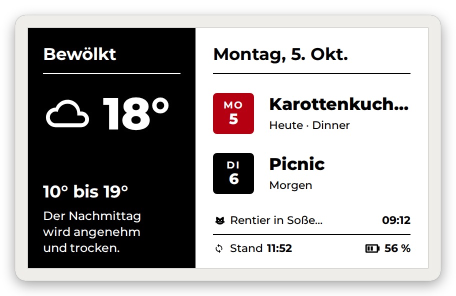
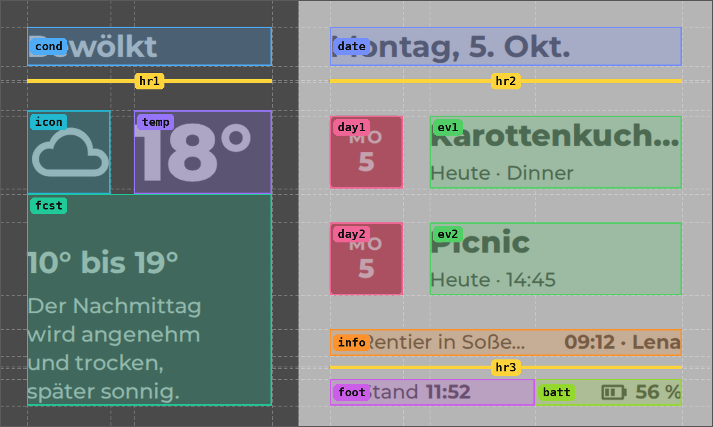

# E-Ink Dashboard · one Paper Buttons Row card

<p align="center">
  <a href="original.yaml"></a>
</p>

A complete 800 × 480 e-ink dashboard in **one** [Paper Buttons Row](https://github.com/jcwillox/lovelace-paper-buttons-row) card.
[Puppet](https://github.com/balloob/home-assistant-addons/tree/main/puppet) screenshots it, the display shows the image.

## Setup

1. Install [Paper Buttons Row](https://github.com/jcwillox/lovelace-paper-buttons-row) (HACS) and the [Puppet](https://github.com/balloob/home-assistant-addons/tree/main/puppet) add-on (`access_token` = long-lived token).
2. Add [`sensors.yaml`](sensors.yaml) as a package → set your calendars + weather.
3. New view: type **Panel**, path `eink` → manual card → paste [`card.yaml`](card.yaml) → set your entities.
4. Point your display to:

   ```
   http://<HA-IP>:10000/lovelace/eink?viewport=800x480
   ```

   Optional: `&colors=000000,FFFFFF,FF0000` · `&rotate=90` · `&format=bmp` · `&lang=de`

## How it works

<p align="center"></p>

- Row container → **CSS grid** (`grid-template-areas`)
- Each button → **one area** (`grid-area`)
- **Jinja** in `name`, `state`, `icon` and every style value
- `state` + `state_icons` → icon from any value (weather, battery)
- Lines = empty 2 px buttons · black/white split = hard-stop gradient
- `base_config` = shared defaults · `--eink-accent` = one accent color

## Files

| File | |
|---|---|
| [`card.yaml`](card.yaml) | Generic card – start here |
| [`sensors.yaml`](sensors.yaml) | Calendar + weather sensors for `card.yaml` |
| [`original.yaml`](original.yaml) | My card (my sensors, German) |
